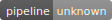
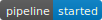
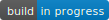
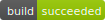
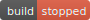
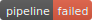
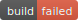
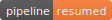
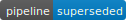

aws-cloudformation-badges
=========================

Wrapping the excellent idea from [codebuild-codepipeline-badges](https://github.com/jSherz/codebuild-codepipeline-badges)
by @jSherz into a re-usable CloudFormation template.

This template is an all-in-one solution that ensures that all AWS resources
required to support badges are under CloudFormation control.

The stack created with this template defines the minimaly required set of
permissions for the Lambd role to generate badges.  Moreover, the stack
pre-generates the "unknown status" badges for all specified CodePipelines
and CodeBuild during the stack creation time, so you can link to the
badges right away.

Unfortunately, due to the CloudFormation limitation on the size of inline
Lambda the code was highly optimised to fit into the 4Kb limit (shame on
you AWS for counting the leading whitespace toward this limit in YAML
templates!).

Synopsis
--------

Standalone stack deployment:
```bash
$ aws cloudformation deploy --template-file badges.template \
        --stack-name badges \
        --parameter-overrides \
                CodeBuildProjects=project1,project2,project3 \
                CodePipelines=pipeline1,pipeline2 \
        --capabilities CAPABILITY_IAM
```

Part of another template (nested stack) using JSON notation:
```json
…
"Resources": {
…
        "Badges": {
                "Type": "AWS::CloudFormation::Stack",
                "Properties": {
                        "TemplateURL": { "Fn::Sub": "https://s3-${AWS::Region}.amazonaws.com/${BucketWithTemplate}/badges.template" },
                        "Parameters": {
                                "CodeBuildProjects": [
                                        { "Ref": "Project1" },
                                        { "Ref": "Project2" }
                                ],
                                "CodePipelines": [
                                        { "Ref": "Pipeline1" },
                                        { "Ref": "Pipeline2" }
                                ]
                        },
                        "TimeoutInMinutes": "15"
                }
        },
…
```

Part of anothr template (a nested stack) using YAML notation:
```yaml
…
Resources:
…
    Badges:
        Type: AWS::CloudFormation::Stack
        Properties:
            TemplateURL: !Sub 'https://s3-${AWS::Region}.amazonaws.com/${BucketWithTemplate}/badges.template'
            Parameters:
                CodeBuildProjects:
                    - Project1
                    - Project2
                CodePipelines:
                    - Pipeline1
                    - Pipeline2
            TimeoutInMinutes: 15
…
```

You can provide just CodeBuild project names, CodePipeline names, or both --
the template will determine what you want and will generate resources
accordingly.

Badges
------

To keep everything embeded in the template and to avoid going through the
two-stage deployment of Lambda the badges are dynamically generated in the
in-line code.

The badge template can be found in the [badge.svg.in](badge.svg.in) file in this
repository.  The file contains some placeholders (such as @W@ for width,
etc.) which are replaced at runtime before the final badge file is
uploaded to the S3 bucket.

If you wish to create your custom badges, use the [badge.svg.in](bage.svg.in) file
as your template.  Once you are done, run it through base64, make the
result to be a single base64-encooded line, and update the code.

The current look and feel of the generated badges is as follows:

 CodePipeline | CodeBuild |
 :----------- | :-------- |
  | 
  | 
  | 
  | 
  | 
  |
  |

Linking to the badges
---------------------

There are two options on how you can expose a badge on a page:

1. You can just use the `&lt;img src="URL/(pipeline|badge)/(name_of_pipeline_or_badge).svg" /&gt;`.
   This will render the badge once and to get the badge update you will need to
   reload the page (or the badge element).  The `URL` can be retrieved from the
   stack output (it is either `BucketStackUrl` if you care about IPv4 addresses
   only or `BucketDualStackUrl` if you want a URL that also resoves to the IPv6
   addresses).

2. If you can use `&lt;iframe src=… /&gt;`, `&lt;embed src=… /&gt;`, or
   `&lt;object data=… /&gt;` for embedding the SVG badge, then you will get the
   automatic badge refresh for free (thanks for the small script incorporated
   inside the generated badge SVG).

   By default, the refresh time is set to 30 seconds, but you can specify your
   own frequency by appending `#t=NUMBER` at the end of the badge URL, e.g.
   to refresh the badge every 5 seconds you may want to embed the badge as
   follows: `&lt;embed src="URL/(pipeline|badge)/(name_of_pipeline_or_badge).svg#t=5000" /&gt;`

Have fun!
